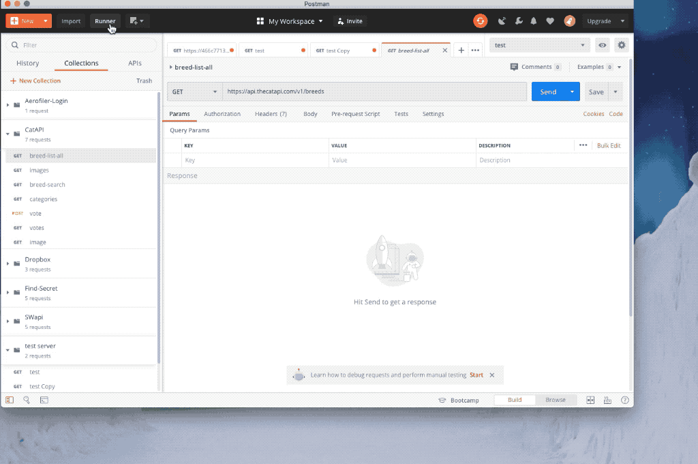

# Course Details


**Course Name:** API Testing Foundations

**Author:**  Dave Westerveld

**Link:** [LinkedIn](#https://www.linkedin.com/learning/api-testing-foundations)


# Table of Contents 

[TOC]


- [Table of Contents](#table-of-contents)
- [1. Understanding Web Services and APIs](#1-understanding-web-services-and-apis)
  * [Introduction to web services](#introduction-to-web-services)
  * [Understanding API Terminology](#understanding-api-terminology)
  * [Types of APIS](#types-of-apis)
  * [Map your API](#map-your-api)
  * [Risks of using services and APIs](#risks-of-using-services-and-apis)
- [2. Getting Started with API Testing](#2-getting-started-with-api-testing)
  * [Postman](#postman)
  * [Install and setup of API challenges](#install-and-setup-of-api-challenges)
  * [Exploring API](#exploring-api)
  * [Map the API Challenge](#map-the-api-challenge)
- [3. API Authorization](#3-api-authorization)
  * [Overview of authorization and authentication](#overview-of-authorization-and-authentication)
  * [Using OAuth tokens](#using-oauth-tokens)
  * [Finding and using bearer tokens](#finding-and-using-bearer-tokens)
  * [Additional authentication methods](#additional-authentication-methods)
- [4. Hands-on API Testing](#4-hands-on-api-testing)
  * [Testing GET calls](#testing-get-calls)
  * [Challenge: Find the secret](#challenge--find-the-secret)
  * [Testing POST calls](#testing-post-calls)
  * [Testing PUT calls](#testing-put-calls)
  * [Testing DELETE calls](#testing-delete-calls)
  * [Challenge: Find the 500 Error](#challenge--find-the-500-error)
- [5. Additional API Testing Considerations](#5-additional-api-testing-considerations)
  * [Using mocks, stubs, and fakes in API](#using-mocks--stubs--and-fakes-in-api)
  * [API Automation](#api-automation)
  * [Performance Testing](#performance-testing)
  * [Security Testing](#security-testing)
  * [Testing microservices and the Internet of Things (IoT)](#testing-microservices-and-the-internet-of-things--iot-)
  * [Next steps](#next-steps)


# 1. Understanding Web Services and APIs

## Introduction to web services 

Input -> Service -> Output

**Example:** api.mathjs.org

 

## Understanding API Terminology

Verbs:

- get - retreive information
- post - create resource
- put - update 
- delete

Nouns: resources (url)


## Types of APIS

- REST - Representation State Transfer,  very popular 
- SOAP
- GraphQL 
- Hypermedia

Main dif between REST and SOAP. SOAP is mor standardised, more strict rules applied to form of SOAP message and response


## Map your API

- Documentation
- Ask developer
- Explore using tools


## Risks of using services and APIs

- API changes
- Availability
- Timing of responses
- Performance/security


# 2. Getting Started with API Testing


## Postman

- request > name > name collection


## Install and setup of API challenges

- https://github.com/djwester/api-testing-foundations.git


## Exploring API

- Star Wars API:  www. swapi.dev
- Sample requests
  - https://swapi.dev/api/starships
  - https://swapi.dev/api/films
  - https://swapi.dev/api/films/1

```
{
	"title": "A New Hope",
	"episode_id": 4,
	"opening_crawl": "It is a period of civil war.\r\nRebel spaceships, striking\r\nfrom a hidden base, have won\r\ntheir first victory against\r\nthe evil Galactic Empire.\r\n\r\nDuring the battle, Rebel\r\nspies managed to steal secret\r\nplans to the Empire's\r\nultimate weapon, the DEATH\r\nSTAR, an armored space\r\nstation with enough power\r\nto destroy an entire planet.\r\n\r\nPursued by the Empire's\r\nsinister agents, Princess\r\nLeia races home aboard her\r\nstarship, custodian of the\r\nstolen plans that can save her\r\npeople and restore\r\nfreedom to the galaxy....",
	"director": "George Lucas",
	"producer": "Gary Kurtz, Rick McCallum",
	"release_date": "1977-05-25",
	"characters": [
		"http://swapi.dev/api/people/1/",
		"http://swapi.dev/api/people/2/",
		"http://swapi.dev/api/people/3/",
	...
	...
	
}
```


- https://swapi.dev/api/people/2


## Map the API Challenge

- https://api.thecatapi.com/v1/categories

**Endpoints:**

- /breeds
- /categories
- /votes
- /favorites

**Endpoints, methods, query parameters and examples:**

- **/images - endpoints**

  - **/images/search** - get all
  - **GET:  /images/upload** - get your uploaded images
  - **POST: /images/upload** - upload image
  - **GET: /images/{image_id}** - get image
  - **DELETE: /images/{image_id}**  - delete uploaded image
  - **GET: /images/{image_id}/analysis** - get analysis result

- **/images/search - query params**

  - size: full, med, smal, thumb
  - mime_types: true
  - order: asc, desc
  - limit: 1 ... 100
  - page: min 0
  - category_ids: integer
  - format: json, src
  - breed_id: string
  - **example:** https://api.thecatapi.com/v1/images/search?category_ids=3&size=med&limit=2

  ```
  [
      {
          "breeds": [],
          "categories": [
              {
                  "id": 3,
                  "name": "funny"
              }
          ],
          "id": "8f",
          "url": "https://cdn2.thecatapi.com/images/8f.gif",
          "width": 480,
          "height": 270
      },
      {
          "breeds": [],
          "categories": [
              {
                  "id": 3,
                  "name": "funny"
              }
          ],
          "id": "14g",
          "url": "https://cdn2.thecatapi.com/images/14g.gif",
          "width": 216,
          "height": 197
      }
  ]
  ```

  

- **/categories - query params**

  - limit - integer
  - page- integer
  - **example:** https://api.thecatapi.com/v1/categories?limit=2

  ```
  [
      {
          "breeds": [],
          "categories": [
              {
                  "id": 3,
                  "name": "funny"
              }
          ],
          "id": "8e",
          "url": "https://cdn2.thecatapi.com/images/8e.gif",
          "width": 343,
          "height": 270
      },
      {
          "breeds": [],
          "categories": [
              {
                  "id": 3,
                  "name": "funny"
              }
          ],
          "id": "13i",
          "url": "https://cdn2.thecatapi.com/images/13i.gif",
          "width": 300,
          "height": 199
      }
  ]
  ```


# 3. API Authorization


## Overview of authorization and authentication

- authentication - who am I
- authorization - what I am authorized to do


## 	Using OAuth tokens

auth server  ↔  application  ↔ web service

OAuth 2.0

- Token
- Headers: 
  - Autorization : Bearer {token}


## Finding and using bearer tokens

- usually can generate using the service
- can have different permissions


## Additional authentication methods

- Basic auth: user / password

- Bearer token

- AWS Signature


# 4. Hands-on API Testing


## Testing GET calls


## Challenge: Find the secret


## Testing POST calls

- malicious users
- accidentally using it wrong way


## Testing PUT calls

- make sure updating one thing in system also updates associated resources
- **example:** updating comment and viewing  blogpost with updated comment
- make sure API does not compromise sequrity of the system by returning responses which provide some information 
- example: 
  - **404 status code** - does not say that resource exists
  - **401 unauthorized** - says that that resourse exists


## Testing DELETE calls

- check that we cannot delete things that should not be deleted
- can't delete another user's content
- check that we can delete only  if we have permissions
- shared resources
- unable to deleteobject until child  objects have been removed


## Challenge: Find the 500 Error

- 500 error when we POST using body of existing comment :

  - **POST http://localhost:3000/comments/**

  - ```
    {
      "id": 1,
      "title": "The FIRST blog post",
      "body": "This is my 2nd blog post",
      "profileId": 1
    }
    ```

  - ~~~
    500Internal Server Error
    
    Error: Insert failed, duplicate id
    at Function.insert
    (/Users/maksim/repos/courses/api-testing-foundations/api-testing-foundations-master/node_modules/lodash-id/src/index.js:49:18)
    ~~~

  500 error when we POST using body of existing profile :

  - **POST http://localhost:3000/profiles/**

  - ```
    {
    "id": 2
    }
    ```

  - ```
    500Internal Server Error
    
    Error: Insert failed, duplicate id
    at Function.insert
    (/Users/maksim/repos/courses/api-testing-foundations/api-testing-foundations-master/node_modules/lodash-id/src/index.js:49:18)
    ```

    

# 5. Additional API Testing Considerations


## Using mocks, stubs, and fakes in API

- they stand in for a  real part of a system

**Why use?**

- isolate server (we do not want create data in server)
- server not available

**Wher  to find in Postma**n?

- ↖ new > mock server > 
- method: GET > path:  test > response code: 200 > response body > got test
- name
- create server > click on url

**Why be careful?**

- we can miss some thing
- make sure at some point test with real system and data


## API Automation

- exploation lays the foundation
- automation relies on exploration but we need to repeat them
  - things that shoiuld not changes
  - things you want to know changed

**Approaches**

- data driven - check every endpoint or combination
- workflow driven - follow user's workflows
- do not automate everything (some things is really hard to automate)


## Performance Testing

- load testing - determines performance under real-life  load conditions
- speed testing - how fast system responses 
- stress testing - verify the stability and reliability under extremely heavy load conditions

Postman example:

- select request
- ↖ runner 
-  iterations: 100
- delay: 0
- run




## Security Testing

- not only auth service

- vulnerabilities: check standard sequirity flaws

- **example:** cross site scripting - target scripts embedded in a page that are executed on the client side i.e. user browser

- **OWASP** - Open Web Security Project,  publishes a list of top web security vulnerabilities based on the data from various security organizations

- **example**: Testing for Credentials Transported over an Encrypted Channel [link](#https://owasp.org/www-project-web-security-testing-guide/stable/4-Web_Application_Security_Testing/04-Authentication_Testing/01-Testing_for_Credentials_Transported_over_an_Encrypted_Channel.html)

- **examples:** top 10 security vulnerabilities [link](#https://www.guru99.com/web-security-vulnerabilities.html)

- validation: make sure validation is correctly done

  

## Testing microservices and the Internet of Things (IoT)


- microservicea are API driven
- IoT are API driven
- cloud-based, distributed systems  are API driven


## Next steps


- Katrina the Tester: API, Web Services & Microservices Testing Pathway [link](#http://katrinatester.blogspot.com/2015/09/api-web-services-microservices-testing.html)
- DannyDainton: All-Things-Postman [link](#https://github.com/DannyDainton/All-Things-Postman)

