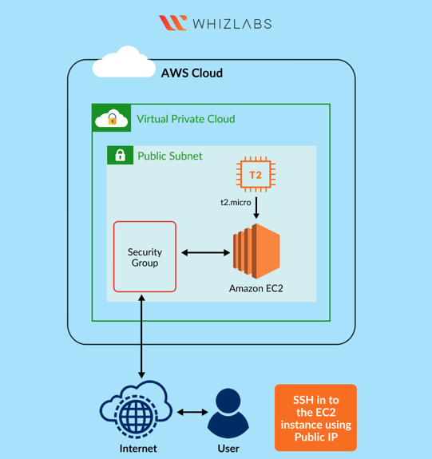
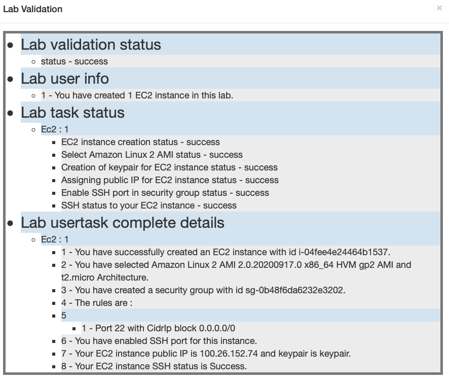

# Labs

Completed labs and corresponding notes from the AWS Cloud Practitioner course by Whizlabs.


## Lab: Access and tour AWS console

- sign in and go to AWS Management Console
- view all services ↖ "Services"
- view/select region ↗ "Sydney"
- to add a shortcut click on pushpit icon  ↑
- drag a any service  to navigation bar
- click on pushpit icon  ↑


## Introduction to AWS Identity Access Management (IAM)

**Create new users**

- sign in to AWS Management Console
- to create new user Services  > IAM
- Select  ← "Users" > Add user
- fill in Name 
- Select AWS Access type 
- AWS Management Console access: Check > Programmatic access: Uncheck
- Require password reset:  Uncheck
- Console password: abcd
- next: Permissions > next: Tags
- Key: team
- Value: developers
- create users
- Note: Ignore  error if it appears while creating Users.

```
Success
You successfully created the users shown below. You can view and download user security credentials. You can also email users instructions for signing in to the AWS Management Console. This is the last time these credentials will be available to download. However, you can create new credentials at any time.

Users with AWS Management Console access can sign-in at: https://
```

- download csv file with sign in link
- click on the sign in link > enter user name > enter password
- you are signed in


**Create IAM Group**

- to create new group  Services  > IAM
- Select  ← "Groups" > Create New Group
- Name: Dev > next step
- Attach policy > AWSCodeDeployFullAccess, AWSCodeDeployRole, Billing (example)
- next step
- create group


**Add IAM user to IAM group**

- Services  > IAM

- Select  ← "Groups" >  select group

- select Users tab

- add users to group > select users > add users

  


## Launching EC2 Machine and SSH

- [instructions](lab_launching_ec2_ssh/task_details.pdf)

- **architechture-diagram**





- **lab results**




- 

