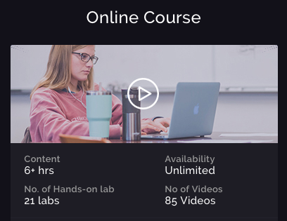
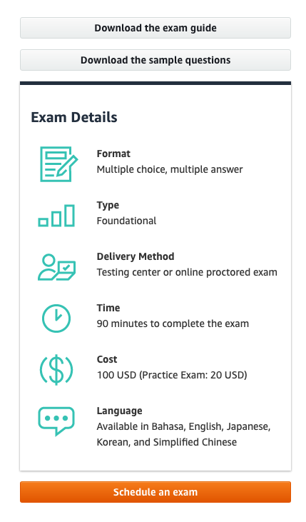
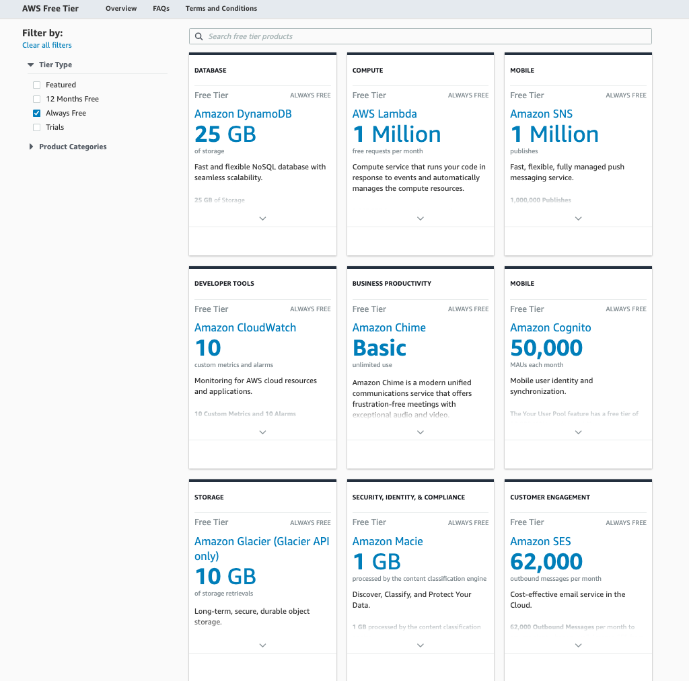
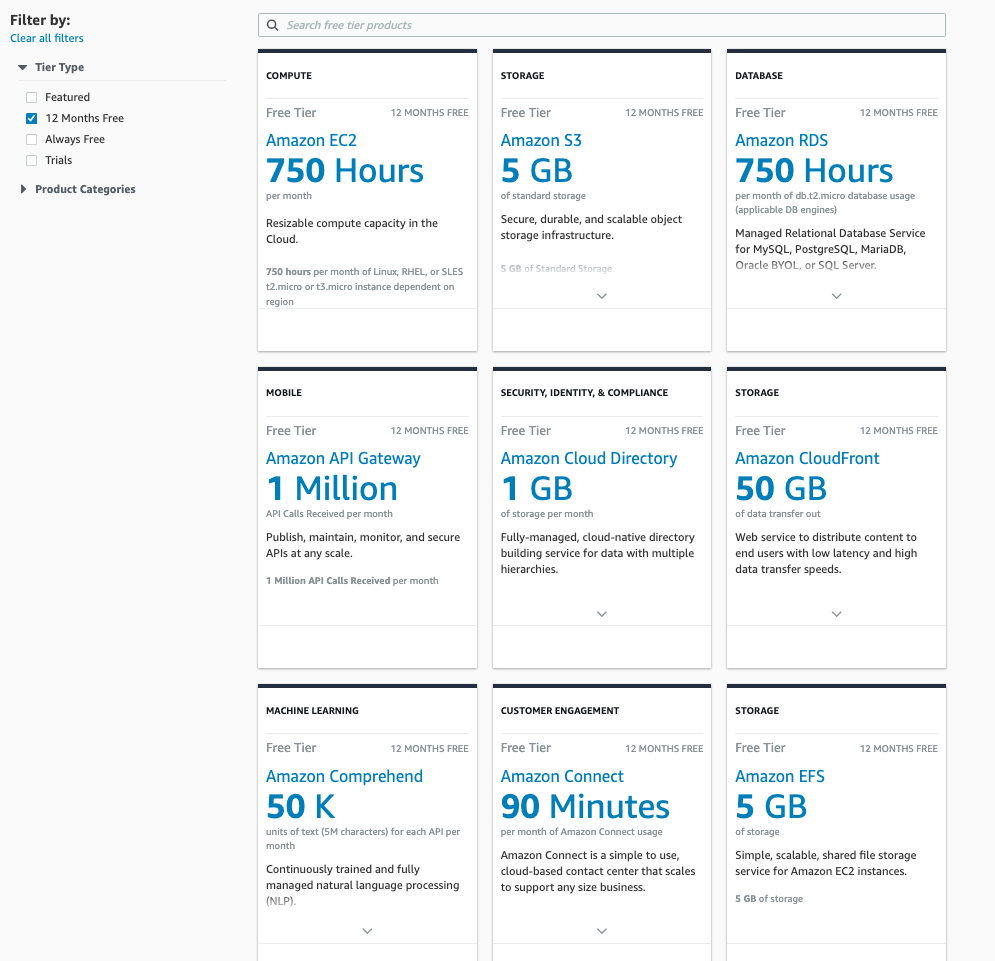
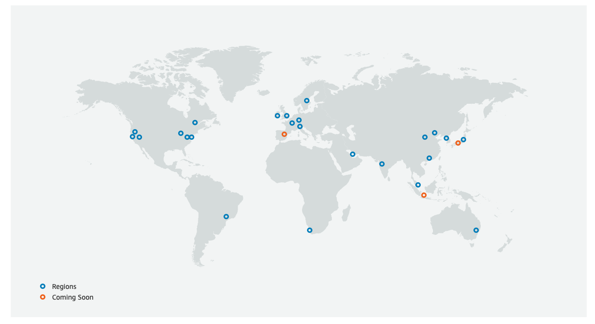

# Course Details

**Course Name:** AWS Cloud Practitioner

**Website:** wizlabz

**Link:** [Whizlabs](https://www.whizlabs.com/aws-certified-cloud-practitioner/)

**Date:** July 2020

# Table of Contents 

- [Course Details](#course-details)
- [Table of Contents](#table-of-contents)
- [Introduction](#introduction)
  * [1. Course Introduction](#1-course-introduction)
  * [Elements of web-based applications](#elements-of-web-based-applications)
  * [2. About the exam](#2-about-the-exam)
- [Cloud Concepts](#cloud-concepts)
  * [3. Agenda](#3-agenda)
  * [4. What is the Cloud?](#4-what-is-the-cloud)
  * [5. What is Amazon Web Services?](#5-what-is-amazon-web-services)
  * [6. AWS Free Account](#6-aws-free-account)
  * [7. AWS Console](#7-aws-console)
  * [8. Regions and Availability Zones](#8-regions-and-availability-zones)
  * [9. AWS Support](#9-aws-support)
  * [10. Summary](#10-summary)
- [AWS Core Services](#aws-core-services)
  * [11. AWS Core Services Overview](#11-aws-core-services-overview)
  * [12. Simple Storage Service](#12-simple-storage-service)

<small><i><a href='http://ecotrust-canada.github.io/markdown-toc/'>Table of contents generated with markdown-toc</a></i></small>

[TOC]

# Introduction 

## 1. Course Introduction

##  Elements of web-based applications

- browser [desktop, laptop, mobile device] ↔  HTTP(S) ↔ web proxy ↔   [web server [HTML, Script code] ↔ database or flat file]
- web server  ↔  LDAP (user authentication)

## 2. About the exam

**link:** https://aws.amazon.com/certification/certified-cloud-practitioner/

**Abilities Validated by the Certification:**

- Define what the AWS Cloud is and the basic global infrastructure
- Describe basic AWS Cloud architectural principles
- Describe the AWS Cloud value proposition
- Describe key services on the AWS platform and their common use cases (for example, compute and analytics)
- Describe basic security and compliance aspects of the AWS platform and the shared security model
  Define the billing, account management, and pricing models
- Identify sources of documentation or technical assistance (for example, whitepapers or support tickets)
  Describe basic/core characteristics of deploying and operating in the AWS Cloud

# Cloud Concepts

## 3. Agenda

## 4. What is the Cloud?

Examples of lcoud services (internet services)

- Gmail - email
- Dropbox, Google Drive - file sharing
- Youtube - video sharing
- Facebook - social media

Benefits of using CS:

- affordable
- available across the world
- scalable
- reliable

## 5. What is Amazon Web Services?

**AWS:**

- largest CS platform
- launched in 2002
- more than 100 service available currently
- https://aws.amazon.com/

**Some services:**

- Elastic Compute CLoud
- Simple Storage Service
- Relational Database Service
- Virtual Private Service

## 6. AWS Free Account

**Free services:**

**12 months free:**

## 7. AWS Console

- Sign Up new account 
- Sign In
- access services using search field, top menu or scroll down to use simple wizards
- my account ↗
- billing dashboard ↗
- aws region ↗
- aws support ↗

## 8. Regions and Availability Zones

- AWS have regions across the world which can be used to host resources
- new data centers are added as AWS expanding their global infrastructure
- factors influencing region:
  - close proximity to users
  - data requirement for specific region (stored in specific region)

- AWS have multiple data centers in availability zone:

- availability zone (data center 1, data center 2, ...)

- AWS have multiple availability zones  in region:

- region (availability zone 1, availability zone 2, ... )

  

## 9. AWS Support

- **3 support plans available:**
  - developer - cheapest, but longer response time, starts at $29 per month
  - business
  - enterprise - most expensive, starts at $15K per month response time < 15 min, dedicated  account manager and other features
- Amazon Partner Network (APN) - is the global partner program for technology and consulting businesses
- https://aws.amazon.com/partners/
- APN Partner Types
  - **APN Consulting Partners** - professional services firms that help customers of all types and sizes **design, architect, build, migrate, and manage** their workloads and applications on AWS
  - **APN Technology Partners** - **provide hardware**, connectivity services, or software solutions that are either hosted on, or integrated with, the AWS Cloud

## 10. Summary

- what is cloud computing
- concept of AWS
- tour of AWS console 
- AWS suport plans
- global infrustructure

# AWS Core Services

## 11. AWS Core Services Overview

- Simple Storage Service
- Amazon Glacier
- Virtual Private Cloud
- Elastic Compute Cloud
- Elastick Block Storage
- Costing Aspects

## 12. Simple Storage Service

- object level storage
- allows to store and retrieve any amount of data 
- highly scalable
- highly reliable

**Structure**

- S3 > bucket(s) > object(s)

**Storage classes**

- standard (default) - accessed **frequently**
- reduced redundancy  - to store non-critical data
- STANDARD_IA, ONEZONE_IA - accessed **infrequently**
- GLACIER and DEEP ARCHIVE - for data archival, lower costs

**Other S3 features**

- versioning
- use for static website
- cross region replication - better reliability
- manage access - using Bucket policies

## 13. Lab - Simple Storage Service Part 1

- sign in to AWS Management Console
- ↖ "Services" > S3
- create bucket > name (must be unique across AWS) > create
- click on the bucket name
- upload > add file > upload
- to create folder > select bucket > create folder
- note: anonymous user cannot access bucket  objects via url link

To make object public

- go to bucket > permissions > public access settings > edit
- uncheck Block public access to buckets and objects granted through new access control lists (ACLs) > save > confirm
- select file/object in bucket  > make public
- go to bucket > permissions > Block public access > edit
- uncheck Block public access to buckets and objects granted through any access control lists (ACLs) > save > confirm
- now file/object can be accessed anonymously 

## 14. Lab - Simple Storage Service Part 2

- sign in to AWS Management Console
- ↖ "Services" > S3
- select bucket > Properties > set up necessary properties
  - versioning
  - server access logging
  - static website hosting
  - object level logging
  - default encryption
  - other
- to access objet properties
- select object > properties
  - storage class
  - encryption
  - metadata 
  - tags
  - object lock

## 15.  Lab - S3 - Static Website Hosting

- sign in to AWS Management Console
- ↖ "Services" > S3
- properties > Use this bucket to host a website
- fill in index.html name as default page
- copy endpoint http://mzinb1.s3-website-ap-southeast-2.amazonaws.com
- go to bucket > click file >make public
- visit page using endpoint link
- page shoould be displaying

## 16. Amazon Glacier

- used for cold archive storage
- much lower cost compared to standard class of S3

**How it works**

- create vault to hold the objects
- to upload object need to use AWS CLI or SDK
- Lifecycle feature in S3 can be used to move object to Glacier
- to retrieve object need to submit job request (takes 3-5 hours to download object)
- expedited retrieval (higher cost)

## 17. Lab - Amazon Glacier

- sign in to AWS Management Console
- ↖ "Services" > S3 Glacier
- create vault > enter name > next > next > submit

- to use Lifecycle feature upload object to bucket
- open bucket > management > add lifecycle rule
- enter tag or all objects > next
- current version > add transition > Trnsition to Glacier after <days>
- next > save

## 18. Virtual Private Cloud 

- VPC service allows to have isolated virtual network in AWS.

- VPC allows launch resources such as EC2.

- You can define a network connectivity.

- You can have different networks for different purposes.

- Each network will have the servers placed in them.

- the servers will then get IP addresses.

- AWS VPC will be allocated a CDIDR block (e.g. 10.0.0.0/16).

- Structure:

  - VPC (CIDR block).

    - subnet1 (CIDR block - subset of VPC CIDR).

    - subnet2  (CIDR block - subset of VPC CIDR).

      - EC2.
      - EC2.

      

## 19. Lab - Virtual Private Cloud (Creating a Virtual Private Cloud with VPC Wizard)

**Create VPC**

- select region (for example N. Virginia, remember, VPC is a region specific resource)
- view all services ↖ "Services" > VPC > Launch VPC Wizard
- VPC with a Single Public Subnet > Select
- IPv4 CIDR block and the IPv4 CIDR of public subnet will be automatically assigned to you
- enter subnet name > myfirstvpc
- Leave the other feilds as default
- Create VPC

**Resources Created**

- Dashboard > your VPCs
- Click Subnets ↖ (one subnet per availability zone)
- Click Route Tables ↖ (You can see two route tables (one for public subnet and one for private subnet).)
- Click Internet Gateways ↖ (The Internet Gateway is created and is attached to the public subnet. Internet Gateway connects your VPC to the Internet)

​	

## 20. Elastic Compute Cloud  Service

**Key concepts:**

- Allows to create a virtual server on the cloud.

- You can start or stop the virtual server whenever you want.

- You can terminate on-demand servers whenever you want.

- You can host various types of workloads on the servers.

  

  >**Q:** Do you get charged for a 'stopped' instance on EC2?
  >
  >**A:**  No, For stopped instances, AWS does not charge for any instance usage fees, however, you will be charged for any other resources that are attached to your stopped instances such as EBS volume or S3 storage.

**Attributes of EC2 instance:**

- **AMI** - Amazon Machine Image (Win, Linux and others).
- Software preinstalled. For example SQL server.
- **The instance type** - CPU, memory, etc.
- **VPC** - where it will be located.
- **Security Groups** - controls the flow of traffic.
- **Volumes** - storage.
- **Tags** - metadata.

Features:

- **Different pricing models:**
  
- **on demand** - create and terminate at any point in time.
  
- **Monitor instance**

  - this comes automativally with Cloudwatch service.

- Different categories optimized for different **workloads**

  - Compute Optimized

  - Memory Optiized

  - etc.

    

## 21. Lab - Elastic Compute Cloud

Overview

- create EC2 instance
- choose Windows AMI
- connect to the server

Steps

- sign in AWS management console

- compute > EC2

- redirected to **EC2 dashboard** showing status of EC2 instances

- click launch **new instance**

- scroll down and select Microsof Windows Server 2016 Base

- choose **instance type** (CPU, memory, other resources): 

- **note**: cost per hour will depend on CPU, memory and region

  

    >**Q:** Will you be charged if ypou use free EC2  "t2micro"  tier ?
    >
    >**A:**  Only if you consume 750 hours per month

- **configure instance details**: can leave as it is.

- **add storage**: can leave as it is.

- **add tags**: can leave as it is.

- **configure security group**: can leave rule settings as it is and add group name and descroption.

- review instance launch: review.

- click **launch**.

- create **key pair** in order to be able to generate password later.

- download and **save key pair file in a safe place.**

- on the dashboard page new instance will be displayed.

- in the description you can see **public IP**(IPv4) which can be used to connect to the server.

- click **connect** button.

- click **get password**.

- click **choose file** and locate key pair file previously saved.

- click **decrypt password**.

- copy **password**.

- click **download remote desktop file**.

- **double click on remote desktop file** the file 

- **click on connect** and **fill in the password.**

- you will be redirected to Windows screen.

  

## 22. Lab -The AWS Marketplace

**Overview** 

- Create Wordpress solution using AWS Marketplace

**Details**

- Using AWS Marketplace you can deploy custom-base solutions on AWS.
- Example: AMI instance with Ubuntu and preinstalled Wordpress.
- You can access AWS Marketplace during Launching EC2 workflow
  - Step 1 (Choose an AMI) 
  - ↖AWS Marketplace

>**Q**: Do you pay for preinstalled software in addition to EC2 instance costs?
>
>**A**:  It depends. Some solutions have no costs related to software. There are also solutions which include both costs (usually charged per hour). The costs are shown on the page when choosing AMI.

- When creating new instance you can reuse existing key-pair file.
- You can add tags after the EC2 instance has been created.
  - EC2 dashboard
  - Tags - click tab in the middle of the page.
- Copy/paste DNS name from dashboard to browser search bar

## 23. Lab - EC2 Pricing Models

**Overview**

- EC2 Pricing Models

**Pricing models**

- **on-demand** 
  - the most flexible pricing option.
  - not hte most cheapest.
  - cost calculated based on the running time of the instance.
- **spot pricing**
  - up to 90% savings on costs.
  - the instances are available on spare capacity available in AWS.
  - if AWS runs out of capacity the compute capacity will be taken away.
  - when the above happens you can .
    - hibernate.
    - stop.
    - terminate EC2 instance.
  - this pricing option is best for workloads that can be interrupted.

- reserved pricing
  - pay an upfront price and reserve an instance type.
  - can save up to 75%.
  - different types
    - **Standard** - if you are sure of the type of workload (fixed amount of storage, memory and CPUs ) that will run on the EC2 instance.
    - **Convertible** - allows to change  the attributes of the Reserved Instance. It is possible only if the result yields in Reserved Instnces of equal or greater value.
    - **Scheduled** - can launch instnces during specific time windows.

How to view different types of instances:

- go to AWS console.
- click EC2.

- ↖ Instances > Spot Requests or Reserved Instances

**Spot Requests**

- click tab Pricing History.
- see on-demand price and price of Spot instance depending on availability zone.
- click Request Spot Instance if you are ok with the price

**Reserved Instances**

- click Purchase Reserved Instance
- configure: platform, instance type, term (1 year / 3 years), offering class (convertible / standard), payment option
- click search 

## 24 Elastic Block Storage

**Overview**

- block storage for EC2 instances.
- different types of vulumes are available.
- you can have multiple volumes attached to an instance.

EC2

- root volume (set by default and used for OS and underlying configuration purposes).
- data volume  (used for applicatio or data).

- data volume  (used for applicatio or data).

EBS Types

- general purpose SSD - typical workloads such as Web servers.
- provisioned IOPS - more resourceintensive workloads such as databases (more expencsive compared to general purpose).
- throughput optimised HDD - workloads that need more throughput on the volume such as Big Data applications.
- cold HDD - archive storage.

Other features

- enable encryption.
- create snapshots.
- a volume can be attached to any instance in that availability zone.

## 25. Lab: EBS Volumes

**Overview**

- How to work with EBS volumes

**Preconditions**

- EC2 instance has been created

Instructions

- open AWS console

- navigate to EC2 dashboard > Instances

- ↖ Iclick Elastic Block Storage

- view existing volumes

- click Create Volume button

  

- select Volume Type

- fill in Size amount

- select  the same Availability Zone as your existing EC2 instance

- add name tag

- click Create Volume

  

- navigate to EC2 Dashboard (new volume should display and have "available" state)

- select your new volume

- click Actions

- click Attach Volume

- select instance

- click Attach

- new volume should have "in-use" state

If you have EC2 with installed Windows

- open Server Manager
- navigate to Stprage Services > Volumes > Disks
- right-click
- click Bring Online
- right-click
- click Initialize
- right-click
- click New Volume
- go through Wizard
- open This PC
- new Volume should be visible

## 26. Costing in AWS

Available tools

- **Pricing Calculator** - allows to get an indicative pricing on hosting resources in AWS.
- **Billing Section** - Can see the costs to date and the biling details.
- **Cost Explorer** - Allows you to analyse your spend. But you need to enable this in advance.

**Pricing Calculator**

- create estimate
- select region
- add service
- select EC2 specification 
- select EBS size
- view total monthly cost

**Billing Section** 

- go to EC2 Dashboard
- ↗click acc > My Billing Dashboard
- view monthly cost  to date
- ↗click Bill Deatils 

**Cost Explorer**

- go to EC2 Dashboard
- ↗click acc > My Billing Dashboard
- ↖ click Cost Explorer

>To use Cost Explorer you need to enable it. It can take up to 24 hours to view the cost explorer data.

- you can filter
  - period
  - categories
- you can see forecast after you used services for 1-2 months
- you can save reports 

## 27. Lab : Cleaning Up Resources 

Overview

- How to terminate existing EC2 instances

Stop Instance

- go to AWS console
- go to instances
- select instances
- actions > Instance State > stop

>**Q**:  Do you get charged when instance in the "stopped" state
>
>**A**:  No. However, for example if you have combined EBS volume attached to your instnces and  exceeding free limit,  you still will be charged. EBS is separate resource.

Terminate Instance

- go to AWS console
- go to instances
- select instances
- actions > Instance State > stop

>When terminating instance you can keep attached volume so it can be attached to another instance.
>
>When terminating instance all additional attached volumes will not be deleted. You need to select  > actions > delete.

## 28. Benefits of Moving to AWS

- pay-as-you-go: cost effective model for infrastructure hosting.
-  cloud services: new services are rollout.

## 29. Summary

What's covered

- how to work with S3 service.
- how to host a static website.
- what is Amazon Glacier.
- what is the default VPC.
- what is EC2.
- how to spin up an EC2 instance.
- AWS marketplace.
- EC2 pricing models.
- what is EBS.
- benefits of moving to the cloud.

# Cloud Architechture Design 

## 30. Agenda

Overview

- service continuity.
- AWS organization.
- TCO calculator.
- cost allocation tags.

## 31. Service Continuity

**Important aspects** that need to be considered when designing an application (applicable for most applications)

- fault tolerance - if a fault occurs at the infrastructure level, you still need to ensure services can be made available.
- high availability - if infrastructure goes down, you need to ensure the right measures are in place to ensure the application is still available.

Some aspects that are available in AWS for maintaining service or application continuity

- **Availability Zones  and Regions** - deploy EC2 instances across multiple availability zones. If one zone goes down, application still can use other zones. For higher availability an for disaster recovery, deploy secondary solutions to multiple regions.
- **Elastic Load Balancer** - helps to distributetaffic to your underlying EC2 instances. If one EC2 instance goes down, Elastic Load Balancer can direct traffic to another EC2 instance.

Important design concepts

- always decouple components of your application.
- do not have tight integration between application components.
- always design with failure in mind.
- make use of features  available in AWS.

## 32. AWS Organization

