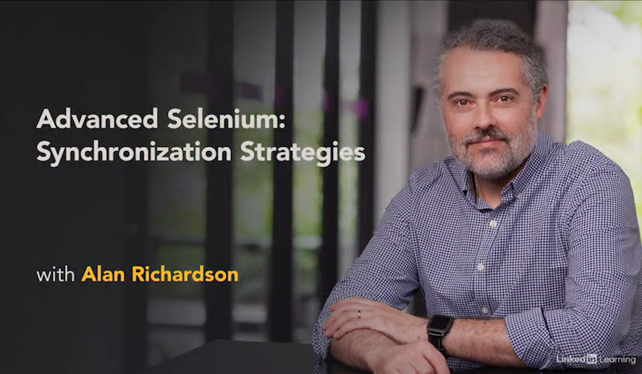

# Course Details

Some notes that I've been taking to help me learn Synchronization Strategies in Selenium. The course uses Java Selenium examples. At the time of doing the course I was using Python Selenium to write my tests. That's why  some examples are adapted to Python. You can find original java code  using GitHub included in the course.

**Course Name:** Advanced Selenium: Synchronization Strategies

**Link:** [LinkedIn Learning](https://www.linkedin.com/learning/advanced-selenium-3-synchronization-strategies)

**Last Updated:** September 2020




# Table of Contents 

- [Course Details](#course-details)
- [Table of Contents](#table-of-contents)
- [Introduction to the Course](#introduction-to-the-course)
  * [End Flacky Tests By Synchronyzing Well](#end-flacky-tests-by-synchronyzing-well)
- [1. Introduction](#1-introduction)
  * [Why Do We Need Synchronization?](#why-do-we-need-synchronization-)
  * [WebDriver Built-in Waits](#webdriver-built-in-waits)
  * [Implicit Wait vs. Explicit Waits](#implicit-wait-vs-explicit-waits)
- [2. Synchronizing with WebDriverWait](#2-synchronizing-with-webdriverwait)
  * [What is WebDriverWait?](#what-is-webdriverwait-)
  * [WebDriverWait Usage Patterns](#webdriverwait-usage-patterns)
  * [Expected Conditions](#expected-conditions)
  * [Writing a Custom Expected Condition](#writing-a-custom-expected-condition)
  * [Configuring WebDriverWait](#configuring-webdriverwait)
- [3. Synchronizing with JavascriptExecutor](#3-synchronizing-with-javascriptexecutor)
  * [Overview of JavaScriptExecutor](#overview-of-javascriptexecutor)
  * [WaitingForJavaScript](#waitingforjavascript)
  * [Using JavaScript for Waiting](#using-javascript-for-waiting)
- [4. Synchronized Components](#4-synchronized-components)
  * [WebDriver Synchronized Components](#webdriver-synchronized-components)
  * [Custom Synchronized Components](#custom-synchronized-components)
- [5. Synchronization strategies](#5-synchronization-strategies)
  * [Introducing Thewaiter](#introducing-thewaiter)
  * [Introducing Awaitility](#introducing-awaitility)
  * [Creating Your Own Libraries](#creating-your-own-libraries)
- [6. Waiting Considerations](#6-waiting-considerations)
  * [Remote WebDriver](#remote-webdriver)
  * [General Tips and Hints](#general-tips-and-hints)
  * [Next Steps](#next-steps)


# Introduction to the Course 


 **Useful Links:**

- SyncHole online resource to practice synchronization https://eviltester.github.io/synchole

- Selenium ExpectedConditions Class: https://www.selenium.dev/selenium/docs/api/dotnet/html/T_OpenQA_Selenium_Support_UI_ExpectedConditions.htm

  

##  End Flacky Tests By Synchronyzing Well

- **problem**: flacky tests - sometimes it works, but sometimes it fails
- **one of the most common causes** : failure to synchronise effectively
- **solutions - synchronize against internal application state, somiteimes workarounds:** 
  - use built-in WebDriver classes
  - user external libraries
  - use JavascriptExecutor to run JS as a part of your WebDriver code


# 1. Introduction


## Why Do We Need Synchronization?


- **example 1**: test fails when driver **click() executed before section with link fully expanded**. 
  - adding delay (e.g sleep (1)) can solve it but is not recommended. Sync on time and not on application state is not recommended.
  - adding implicit wait can solve it but is not recommended. This is global configuration, all other methods used to manipulate browser will use this setting (e.g 2 sec or 10 sec).


## WebDriver Built-in Waits

- WebDriver automatically waits for certain events.

- built-in synchronization has its limitations.

- WebDriver automatically waits for the simple page to load. 

- when some elements on the page populated by JS, there is some delay.

- **WebDriver does not wait for JS to complete, so we have to wait for it separately.**

  

- **example 2:** using **executeScript and document.ready State**
  - webdriver waits until page ReadyState is complete.
  - which is prior to the JS on Load event firing.
  - but after images and stylesheets have loaded.
  - **we still need to wait** for some time after page ReadyState is complete **to allow the JS to populate content**.
  
- WebDriver **does not wait for** 
  - CSS animations to complete
  - JS finish executing

- What is Document.readyState?

  - document has been parsed / loaded

  - CSS and other sub resources have been parsed / loaded.

  - load event has been fired.

    

## Implicit Wait vs. Explicit Waits


- **Implicit Wait:**
  - when you use implicit wait this will affect wait time for all methods in the test.
  - this will result in increased waiting  time and slowing down tests when some of your tests fail (could be legit fails).
  - hardcoding  time in implicit wait may result that in different environment this time will not be enough. 
  - when for example buttons are present on the page but **not clickable WebDrive**r does not throw an exception on click() - WebDriver does not see that click() did not work.


# 2. Synchronizing with WebDriverWait


## What is WebDriverWait


- when we want to wait for a specific condition prior to taking action, we use an **explicit wait**.
- **example 3:** using expected condition to **wait until element is clickable**.
  - WebDriver will wait for max timeout until it is able to click the button.
  - when the same code is repeated many tomes, for example wait for expected condition it makes sense to refactor it 
  - select > refactor > method > extract


## WebDriverWait Usage Patterns

- **WebDriverWait for every sync point**

  - more code required for each sync point, buth **that is ok** since it improves robustness and helps to reduce flakyness. It usually can be refactored.

- **shared local context wait**

  - we can create local variables and methods using WebDriverWait to make code more readable and consize.

- **wait and return value**

  - until() method can return object

- **wait as an alternative to an assertion** (Pylenium example)

  - we can get away without assertion as the test will fail if the element is not found  (not recommended)

  ``` 
      
      # before
      # instead of assertion we can also use wait but get() is shorter and also implements wait
      # the difference is that with until() we can specify custom conditions
      # we can custovize wait_time and ignore exceptions in should()
      assert do.get('.head > .logo', 4).should(4).be_visible()  # logo.
      
      # after
      do.wait(timeout=4).until(lambda x: x.find_element_by_css('.head > .logo')).should(4).be_visible() # logo
  ```

  - **adding redundant assertion may be reasonable** because it makes it little more obvious that assertion is expected at this point. Adding assertion helps to debug.

  ``` 
      
      do.wait(timeout=4).until(lambda x: x.find_element_by_css('.head > .logo')) # logo
      assert do.get('.head > .logo', 4)  # logo.should().be_visible()
  ```

  - **note:** since should() and its methods can  raise AssertionError it is probably ok to use should() without assertion

- shared driver context wait: we can design test framework in a way that allows to share  WebDriverWait in multiple metthods and tests


## Expected Conditions

- import standard EC and use code conditions to explore / find EC
- it is possible to create custom EC which can combine multiple EC with AND, OR logical operators
- some EC return: web elements, booleans, lists, driver instances (switching between frames) 
- EC can take as arguments: locators, web elements


## Writing a Custom Expected Condition

Example:

- ElementExpandedFully
- Mechanism: compare last_height and new_height of the element, then return true if they are equal\


## Configuring WebDriverWait

What can be configured:

```python
class selenium.webdriver.support.wait.WebDriverWait def __init__(self,
             driver: Any,
             timeout: Any,
             poll_frequency: float = POLL_FREQUENCY,
             ignored_exceptions: Any = None) -> None

def selenium.webdriver.support.wait.WebDriverWait def until(self,
          method: Any,
          message: str = '') -> Any

def until_not(self, 
              method, 
              message='')
```

- poll_frequency - by reducing it, test may finish faster
- ignored_exceptions - ElementNotFoundExceptio is default. We can include irrelevant exceptions.
- message - can be customised
- timeout - max wait time


# 3. Synchronizing with JavascriptExecutor


## Overview of JavaScriptExecutor

How we can use it:

- to create useful workarounds and trigger functionality to **put the application into specific state**
- to synchronise on complex wait conditions


Example:

```
driver,execute_script('some JS code here')
```

Method 1: Executing JavaScript at Document Root Level

```python
java_script = 'document.getElementsByName("username")[0].click();'
driver.execute_script(java_script)
# getElementsByName("username") returns all matching elements
```


Method 2: Executing JavaScript at Element Level

```python
user_name = driver.find_element_by_xpath("//button[@name='username']")
driver.execute_script("arguments[0].click;", user_name)
# getElementsByName("username") returns all matching elements
```


How to return value:

```python
print(driver.execute_script('return document.getElementByName("username").innerText')
```


## WaitingForJavaScript

- **Problem:** Common issue people have is working with applications using JS frameworks

- **Solution:** User JavascriptExecutor in combination with waits to synchronize against internal JS state of the app


**How to view JS in Google Dev Tools:** 

- example: https://eviltester.github.io/synchole/messages.html
- got to the page
- inspect
- in console type "totalMessagesReceived"

To find specific variable or function :

- got to the page
- inspect
- sources
- find .js file 

**Returning JS result:**

- Note: it seems that in Python Selenium there is no such thing as ExpectedConditions.jsReturnsValue. It is probably possible to create custom Expected Condition using 

```javascript
window.totalMessagesReceived > 0 && window.renderingQueueCount ==0 ? 'true' : null
// window.totalMessagesReceived > 0 - means JS started
// window.renderingQueueCount ==0 - means finished
// return true if condition evaluated as true or return null if it is false


```

- running this returns error because there is no real context. In webdriver should work

```js
return (window.totalMessagesReceived > 0 && window.renderingQueueCount ==0 ? 'true' : null)
10:24:10.119 VM153:1 Uncaught SyntaxError: Illegal return statement
```

- after we added internal synchronization using JS we still need to have synchronization using GUI because we usually use assertions based on GUI. For example wait unil some text is present in the element. Internal processing can finish before GUI updates the element

**Returning JS result using async call:**

```python
execute_async_script(
script:"window.onMessageQueueEmpty(arguments[arguments.length-1])");
```

Q: Is JS always publicly accessible?


## Using JavaScript for Waiting

- **Problem:** working with JS can affect the app when we do syntax mistakes in the code.
- **Solution:**  Use the code that makes it harder to make mistakes :
  - have less code
  - create abstraction layer to make it easier **to detect syntax** errors and cut down on the amount of  code

- Syntax mistake **example:**

  ```javascript
  // incorrect
  "return (window.totalMessagesReceived > 0 && window.renderingQueueCount =0 ? 'true' : null)"
  // correct
  "return (window.totalMessagesReceived > 0 && window.renderingQueueCount==0 ? 'true' : null)"
  ```

  **Result:** the impact on the running application (window.renderingQueueCount)


# 4. Synchronized Components


## WebDriver Synchronized Components

- Abstraction class is one of the patterns we use when automating tests.
- **Example:** locating button, waiting for button "ready" state, clicking button can be done in the button component class itself.
- WebDriver (Java) also provides support class SlowLoadableComponent.
- If you see the loadable component in production or the slow loadable component, then slow loadable component is the one to use when you want to synchronize on the component or page being fully ready. Because that has the built in wait mechanism.


## Custom Synchronized Components


# 5. Synchronization strategies


## Introducing Thewaiter

- TheWaiter is a 3rd party java library
- Its purpose to help write reliable Selenium tests by using WebDriverWait based methods
- Some examples of waits: 
  - page load complete
  
  - URLs to load in browser
  
  - a WebElement's attribute
  
- TheWaiter is built around the concept that items you are already in the DOM.
- When we using 3rd party tools we not always have the flexibility to create methods  that will suit our needs
- By contrast when we create our own abstraction layer for synchronization we create the code around our domain and environment and do not face that difficulty.
- The good thing about 3rd party libraries is that we can learn from them some useful techniques and patterns.


## Introducing Awaitility

- WebDriverWait is built on Fluent Wait so it can in theory be used for anything.
- Awaitility is on of the generic libraries designed to be used for waiting on anything.
- Examples: 
  - wait forfile to be created, 
  
  - API calls, 
  
  - process activities
  
- Awaitility is open source java library that allows to express expectation of an asynchronous system in a cincise and easy to read manner. It provides framework for waiting rather than conditions to wait.
- It is possible to use Awaitility in tests instead of WebDriverWait. However in this case we would lose the benefit of all the expected conditions support class.


## Creating Your Own Libraries

- Sometimes we need to reuse custom synchronization strategies across page object  than we can create set of custom wait labrary code.
- Using custom wait library code allows us to write more concise and readable tests.
- In many cases it's worth working through your code and refactoring to abstraction layers which allows you to create the domain specific abstractions that you need.
- DSL - Domain Specific Langiuage.


# 6. Waiting Considerations


## Remote WebDriver

- When working with remote WebDriver we may not have to wait as much as running locally, because of the latency involved in the network traffic between issueing a wait and receiving the results.
- We need to consider how our waiting strategy needs to change for remote usage.
- We may not be able to assert on all the conditions that we do locally.
- **Example:**
  - shortlived events
  
  - use remote WebDriver 
  
  - check progress bar progress has value 50
  
  - by the time **when assertion is executed** progress bar progress has gone 50 (it happens too fast)
  
  - as a resul we will not be able to check that assertion
  
  - check progress bar progress has value 50
  
  - in this case test passed
  
  - that means by the time when assertion is executed progress bar progress has not gone 100
  
  - this result however most likely be **intermittent** as we cannot predict **network latency with remote execution**
  
- **Solutions:**
  - change assertions
  - change style of tests and run fewer tests or assertions against GUI
  - change built-in WebDriver timeouts, for example, page load timeout
  - add some toggle flags and our page objects synchronization layers to skip the sync on remote


## General Tips and Hints

- By default WebDriver
  - waits for page contents loaded
  - waits after for msubmission
  - does not wait for JavaScript
  - waits for elements being in the DOM if we are using PageFactory elements.
  
- It is recommended to avoid **implicit waits** as it **slows down test failures.**

- When we change i**mplicit wait** settings it impacts other tests and that can potential slow down entire test execution.

- It is recommended to use **explicit waits and ExpectedConditions**.

- **FluentWait** can handle non-WebdriverWaits, also consider 3rd party libraries such as Awaitility.

  

- Technically WebDriver waits can be used as **an alternative to assertions** (a wait that fails will fail the test). Make sure you add a comment to explain that wait is used as an assertion and not as sync point. 

- It is usually better  **use assertions** because it makes code more readiable. 

- Refactor your code and **extract abstraction layers to build  libraries of classes**. Benefit: they are not spread all over your test and more **centrally maintainable**.

- Building **labraries of custom domain abstracting classes** allows to reuse them in different frameworks.

- It is recommended to **add synchronization into the Page Objects and component objects**. For example: include waiting (use Expected Condition .elementToBeClickable()) in button component. Benefit: easier to maintain, also it makes for anyone using PO and CO to have them automatically synchronize and do not worry about sync in their tests.

- **JavaScript** can be used with JavaScriptExecutor to help us check for internal application state.

  

- **Synchronization** is one of the key difficulties people face when writing the code.

- If test runs reliably when you are debugging it but **fails intermittently**  in different environments than you are probably having synchronization issue.

- **The goal** is to create complex and complicated automated execution that runs **reliably and robustly** in your build process.


## Next Steps

- Use the SyncHole online resource from the course for practice.
- https://eviltester.github.io/synchole
- Create your own simple page objects and refactor syncronization code into POs
- Experiment.
- Amend existing test code - thread.sleep and implicit wait.
- Automate hard-to-automate pages.